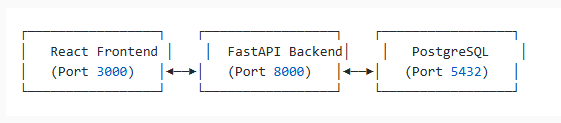

# Task Management DevOps Showcase

## 🚀 Project Overview
A comprehensive task management application demonstrating modern DevOps practices, containerization, and full-stack development skills. Built with Python FastAPI, React, PostgreSQL, and Docker.

## ✨ Features
- **User Authentication**: Secure JWT-based authentication system
- **Task Management**: Complete CRUD operations for tasks
- **Priority System**: Task prioritization with visual indicators
- **Responsive Design**: Mobile-friendly React interface
- **API Documentation**: Auto-generated OpenAPI documentation
- **Containerized Deployment**: Docker and Docker Compose ready

## 🛠 Technology Stack
- **Backend**: Python 3.11, FastAPI, SQLAlchemy, PostgreSQL
- **Frontend**: React 18, Axios, Modern CSS
- **Database**: PostgreSQL 15
- **Containerization**: Docker, Docker Compose
- **Authentication**: JWT tokens with bcrypt password hashing

## 📋 Prerequisites
- Docker and Docker Compose
- Git
- Node.js 18+ (for local development)
- Python 3.11+ (for local development)

## 🚀 Quick Start

### Using Docker Compose (Recommended)
```bash
# Clone the repository
git clone https://github.com/abdi76/task-management-devops.git
cd task-management-devops

# Start all services
docker-compose up --build

# Access the application
# Frontend: http://localhost:3000
# Backend API: http://localhost:8000
# API Docs: http://localhost:8000/docs

📊 API Endpoints
POST /api/auth/register - User registration
POST /api/auth/login - User login
GET /api/tasks - Get user tasks
POST /api/tasks - Create new task
PUT /api/tasks/{id} - Update task
DELETE /api/tasks/{id} - Delete task
GET /health - Health check


🏗 Architecture

